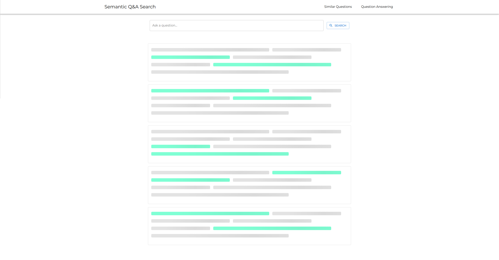
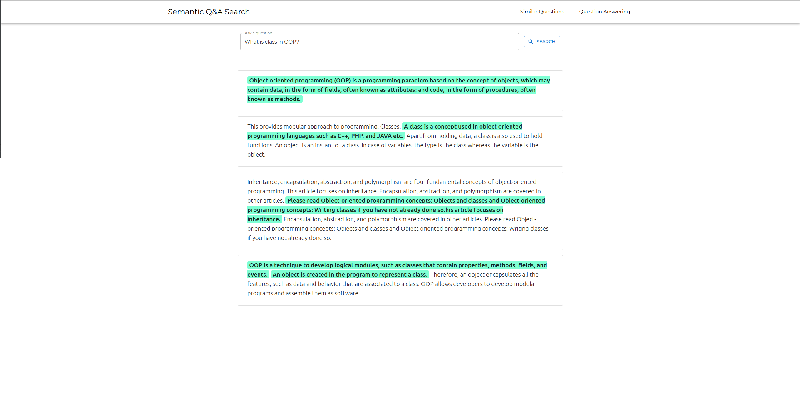
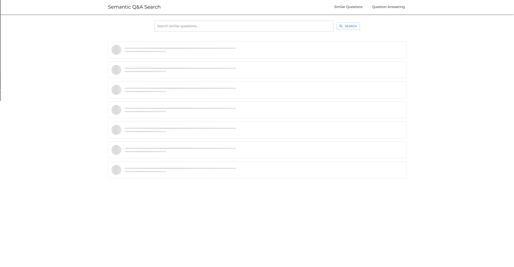
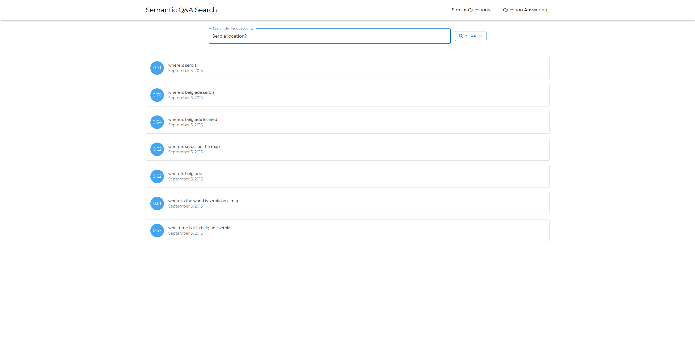

# Semantic Q&A Search

Many problems require a natural language interface for searching or even semantic searching. With many training examples, Deep Learning Algorithms can solve the problem of different types of resources embedding and measuring similarity. But the building up the whole system for semantic searching resources is a much more complex problem and requires wide knowledge.

This project represents an example of a system for semantic searching answers and similar questions. It is mostly composed of existing open-source components.

The most important parts of the project are:

  - **Deep Learning Model - Universal Sentence Encoder**: Google's Universal Sentence Encoder QA models with pre-trained weights. The model is used for embedding paragraphs, sentences, and questions.


  - **Tensorflow Model Serving**: TensorFlow's official model serving system. Its function is wrapping the Universal Sentence Encoder model in RESTful API service.


  - **Vector Search DB - Milvus**:  Milvus ready-to-go vector search db. It is used for fast searching and indexing vectors.


  - **Database - MongoDB**: As Milvus returns only the resource ids and scores. The database is needed for storing resources. Mongo is a suitable solution considering a fast get-by-id operation and the potential for storing a huge amount of data. 


  - **Search API**: Search API is the realization of putting all parts in a functional unity. It brings a unified interface for searching.


  - **Client App**: Client App is a web frontend app for testing and presenting search results.

## Examples

**Question Answering**: The Question-Answering UI with loading view and results view. 





**Similar Questions**: The Similar Question Search UI with loading view and results view.





## 🔗 Dependencies

The whole system is wrapped in docker-compose and requires Docker and docker-compose installed on a machine. 

The images have been tested with following Docker and docker-compose versions:

* Docker == 1.29.2
* docker-compose == 20.10.12


## 🚀 Run

To run whole setup, execute the command:

```shell
docker-compose up
```

After system start up the Swagger Documentation is available on http://localhost:3001/docs and FrontEnd app on http://localhost:8080

## 👤 Author

**Lazar Stamenkovic**

- LinkedIn: [Lazar Stamenkovic](https://www.linkedin.com/in/lazar-stamenkovic-bb301618a/)
- GitHub: [@lazarst96](https://github.com/lazarst96)

## 🔧 Built With

* [Milvus](https://milvus.io/)
* [MongoDB](https://github.com/mongodb/mongo)
* [FastAPI](https://fastapi.tiangolo.com/)
* [Tensorflow](https://www.tensorflow.org/)
* [Tensorflow Serving](https://www.tensorflow.org/tfx/guide/serving)
* [React.js](https://reactjs.org/)


## 📝 License

Copyright © 2022 [Lazar Stamenkovic](https://github.com/lazarst96)
This project is [MIT](https://github.com/lazarst96/semantic-search/blob/main/LICENSE) licensed.
